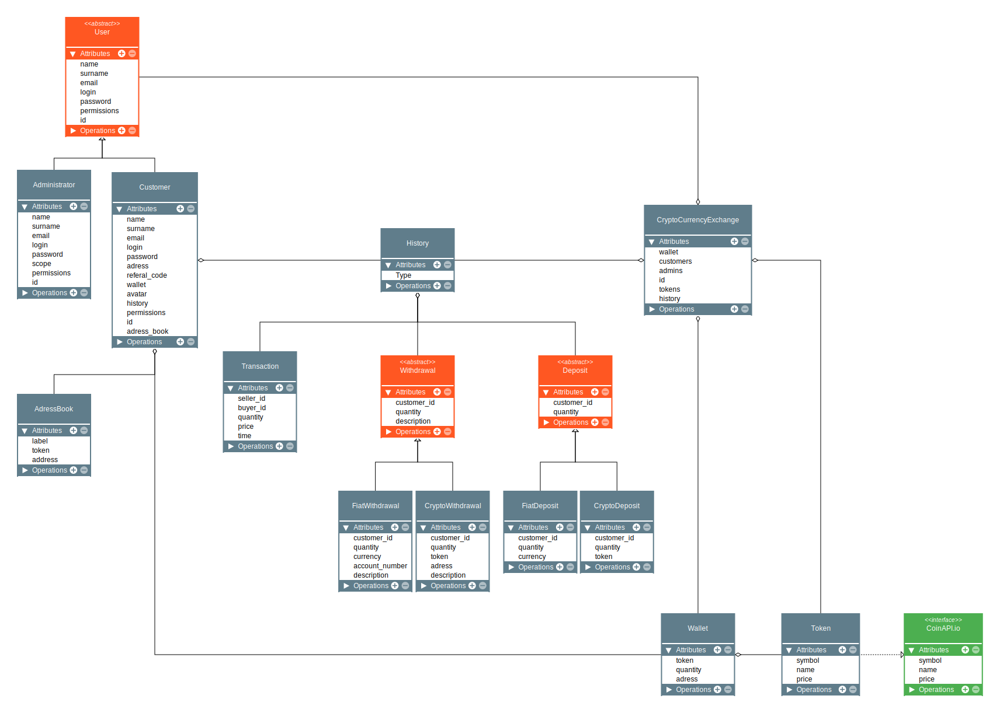
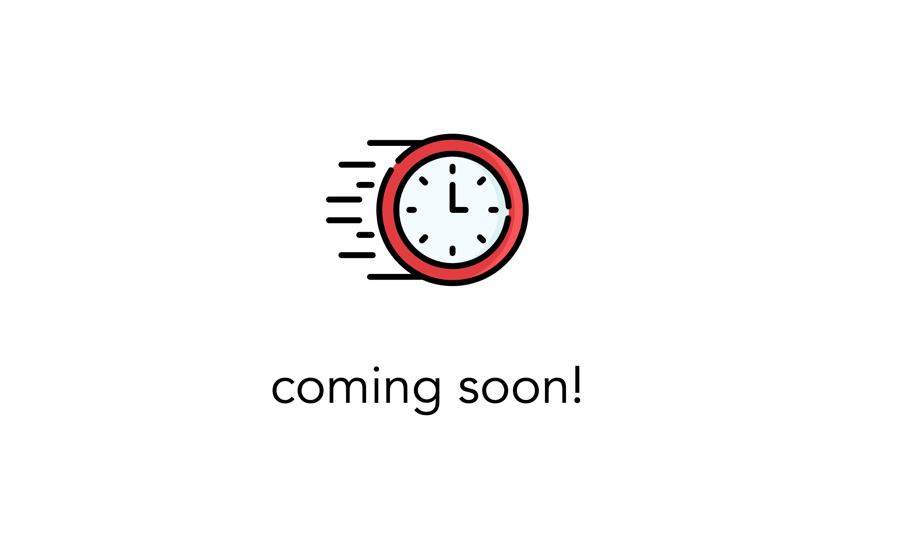

<h1 align="center">CryptoCurrency Exchange

![status][status-badge] ![python version][python-badge] ![django version][django-badge] ![unit tests][unit-tests-badge] ![coverage][coverage-badge] 
</h1> 


<h3>
<p align="center">
  <a href="#key-features">Key Features</a> •
  <a href="#built-with">Built With</a> •
  <a href="#database-schema">Database Schema</a> •
  <a href="#api-reference">API Reference</a> •
  <a href="#how-to-use">How To Use</a> •
  <a href="#roadmap">Roadmap</a>
</p> <br>
</h3>


# About The Project

## Key Features

> **Note**
> The project is under development so some elements from `Key Features` are subject to change

* Registration/Login 
* Password reset by mail
* Two Factor Authentication
* Trading tokens on the exchange
* Withdrawal/Deposit fiat and crypto
* History of operations
* Referal codes
* Adress book with saved contacts
* Token price flow charts
* Creating signals
* API
* Unit tests
* Typing
* Docstrings
* Format according to PEP8
* ...

## Built With

* Python
* Django
* Django REST API
* Pytest
* MySQL
* Bootstrap
* JavaScript
* HTML
* CSS
* HTTP requests
* ...


## Database Schema


# API Reference

<p align="center">

</p>


# How To Use

To clone and run this application, you'll need [Git](https://git-scm.com) installed on your computer.
[Database configuration](https://docs.djangoproject.com/en/4.1/ref/settings/#databases).
From your command line:

```bash
# Clone this repository
$ git clone https://github.com/MGasiorowskii/CryptoCurrencyExchange

# Create file .env with the following content
  API_KEY='ENTER YOUR API KEY'
  DEBUG=True
  DATABASE_NAME='YOUR DATABASE NAME'
  DATABASE_USER='YOUR DATABASE USERNAME'
  DATABASE_PASSWORD='YOUR DATABASE PASSWORD'
  DATABASE_HOST='YOUR DATABASE HOST'
  DATABASE_PORT='YOUR DATABASE PORT'

# Go into the repository
$ cd Exchange

# Apply all migrations
$ python manage.py migrate

# Run the app
$ python manage.py runserver
```

# Roadmap

- [x] Registration/Login
- [x] Logout
- [x] Profile
  - [x] User update Form / Profile update Form
  - [x] Change password form
  - [ ] Referal codes
  - [ ] Adress book with saved contacts
- [x] Password reset by mail
- [ ] Two Factor Authentication
- [x] Exchange
  - [x] List of tokens with price
  - [x] Token price flow charts
- [x] Trading tokens on the exchange
- [ ] Withdrawal/Deposit fiat and crypto
- [x] History of operations
- [ ] Creating signals
- [ ] API
- [ ] ...


> E-mail [gasiorowskii.mateusz@gmail.com](mailto:gasiorowskii.mateusz@gmail.com) &nbsp;&middot;&nbsp;
> GitHub [@MGasiorowskii](https://github.com/MGasiorowskii) &nbsp;&middot;&nbsp;
> Linkedin [Mateusz Gąsiorowski](https://www.linkedin.com/in/mateusz-gąsiorowski-987273197/) &nbsp;&nbsp;


[status-badge]: https://img.shields.io/badge/status-InWork-informational
[python-badge]: https://img.shields.io/badge/python-3.9-blue
[django-badge]: https://img.shields.io/badge/django-4.1-informational
[coverage-badge]: https://img.shields.io/badge/coverage-0%25-red
[unit-tests-badge]: https://img.shields.io/badge/unit_tests-pytest-brighttgreen
